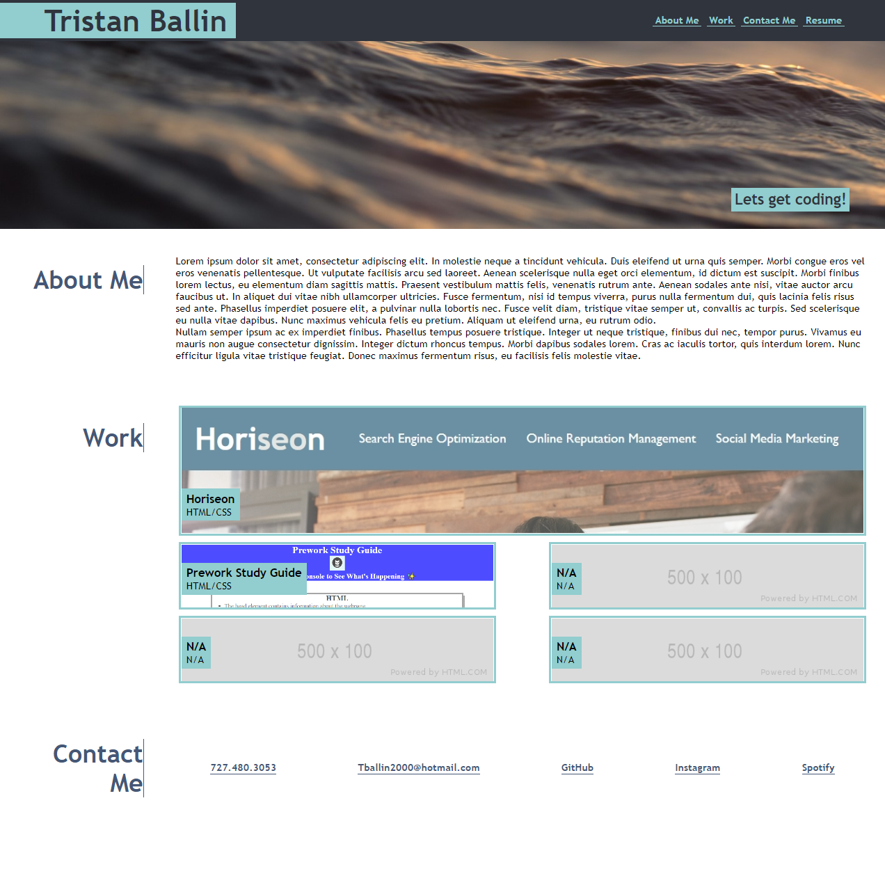

# Code Refactor Starter Code

## Description

The purpose of this website was to be used as a personal portfolio for the projects that I complete and am proud of. This website will be consistantly updated with every new project made during this bootcamp and beyond. Flexboxes are used as the main display type to allow an adaptive display of the content. 

## Usage

You can navigate this webpage by clicking on the links at the top of the screen to go there they are linked. The projects displayed will also redirect you to the repository that each of them are stored on. 

## Screenshot

## Link

[Portfolio](https://thatballinguy.github.io/Portfolio/)

## License

MIT License

Copyright (c) 2022 ThatBallinGuy

Permission is hereby granted, free of charge, to any person obtaining a copy
of this software and associated documentation files (the "Software"), to deal
in the Software without restriction, including without limitation the rights
to use, copy, modify, merge, publish, distribute, sublicense, and/or sell
copies of the Software, and to permit persons to whom the Software is
furnished to do so, subject to the following conditions:

The above copyright notice and this permission notice shall be included in all
copies or substantial portions of the Software.

THE SOFTWARE IS PROVIDED "AS IS", WITHOUT WARRANTY OF ANY KIND, EXPRESS OR
IMPLIED, INCLUDING BUT NOT LIMITED TO THE WARRANTIES OF MERCHANTABILITY,
FITNESS FOR A PARTICULAR PURPOSE AND NONINFRINGEMENT. IN NO EVENT SHALL THE
AUTHORS OR COPYRIGHT HOLDERS BE LIABLE FOR ANY CLAIM, DAMAGES OR OTHER
LIABILITY, WHETHER IN AN ACTION OF CONTRACT, TORT OR OTHERWISE, ARISING FROM,
OUT OF OR IN CONNECTION WITH THE SOFTWARE OR THE USE OR OTHER DEALINGS IN THE
SOFTWARE.